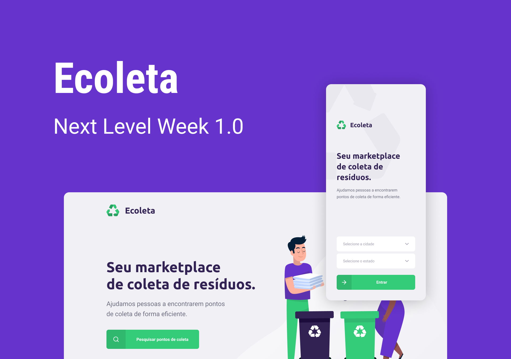

<h3 align="center">
    
    <br>
</h3>

<p align="center"> Aplicação desenvolvida durante a Next Level Week 1.0 da Rocketseat. </p>

## O que é o ecoleta?

O Ecoleta é um marketplace Web e Mobile para ajudar pessoas a encontrarem pontos de coleta para reciclagem em sua cidade.

## Tecnologias Utilizadas

O projeto foi desenvolvido utilizando as seguintes tecnologias

- TypeScript
- Knex
- Node.js
- ReactJS
- React Native

## Manual de utilização

### 1. Clonar o projeto em seu computador.

### 2. Instalação - Back-End
Para instalar as dependências e executar o back em modo desenvolvimento:

```bash
cd server
npm install ou yarn install
npm dev ou yarn dev
```

### 3. Instalação - Front-End 
Para instalar as dependências e iniciar o front:

```bash
cd web
npm install ou yarn install
npm start ou yarn start
```

### 4. Mobile
Primeiramente é necessário colocar o IP do computador no arquivo "src/services/api.ts". Em seguida:

```bash
cd mobile
npm install ou yarn install
npm start ou yarn start
```

<h4 align="center">
    Projeto por <a href="https://www.linkedin.com/in/gabriele-jandres-cavalcanti-249107175/" target="_blank"> Gabriele Jandres </a>
</h4>
